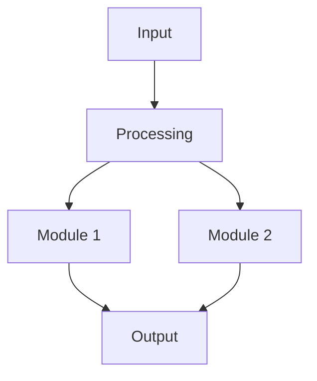

<!-- ============================================================
     📋 PROJECT DOCUMENTATION TEMPLATE
     
     HOW TO USE:
     1. Copy this file and rename it (e.g., "smart-garden.md")
     2. Replace ALL placeholder content below
     3. Add the new file to mkdocs.yml under the Projects nav
     4. Add a card on the Projects overview page (projects/index.md)
     ============================================================ -->

# 🔧 Moon Camp Challenge

In Progress

<!-- Change status:
     Completed
     In Progress
     Planned
-->

> **Duration:** March – June 2026 
> **Role:** Designer and researcher 
> **Team Size:** 3 members
> **Repository:** [GitHub Link](https://github.com/yourusername/project)

---

## 📋 Overview

Write a concise overview of your project. What problem does it solve?
Who is it for? What makes it interesting?

!!! abstract "Project Summary"

    A 2-3 sentence summary of the project that gives readers a quick
    understanding of what this is about.

---

## 🎯 Objectives

1. **Primary Goal** — What is the main thing this project achieves?
2. **Secondary Goal** — Any additional objectives
3. **Learning Goal** — What did you learn through this project?

---

## Design

Describe the high-level architecture or design of your project.
You can use a Mermaid diagram:

---

## ⚙️ Implementation

### Tools & Technologies

| Category | Tools |
|----------|-------|
| Hardware | Arduino, ESP32, Sensors |
| Software | Python, JavaScript, MkDocs |
| Design   | Fusion 360, KiCad |
| Other    | 3D Printer, Laser Cutter |

### Build Process

#### Problems
!! example "Step-by-Step Build"

    1. **Step 1** — Description of what you did
    2. **Step 2** — Description of what you did
    3. **Step 3** — Description of what you did

### Solution

---

## 📸 Gallery

<!-- Embed images from Google Drive:
     1. Upload image to Google Drive
     2. Share → "Anyone with the link"
     3. Copy the FILE_ID from the URL
     4. Use the format below
-->

<!-- Uncomment and replace YOUR_FILE_ID for each image:

-->

_⬆️ Add your project photos above by uncommenting and replacing `YOUR_FILE_ID`._

---

## 📊 Results & Outcomes

Describe the results of your project:

- **Result 1** — What was achieved
- **Result 2** — Measurements, data, or performance metrics
- **Result 3** — User feedback or testing outcomes

!!! success "Key Achievement"

    Highlight your most impressive result or achievement here.

---

## 🧠 Lessons Learned

!!! tip "What I Learned"

    - **Technical Skill 1** — What you learned and how
    - **Technical Skill 2** — What you learned and how
    - **Soft Skill** — e.g., project management, teamwork, documentation

!!! warning "Challenges Faced"

    - **Challenge 1** — Description and how you solved it
    - **Challenge 2** — Description and how you solved it

---

## 🔮 Future Work

- [ ] Planned improvement 1
- [ ] Planned improvement 2
- [ ] Planned improvement 3

---

## 📚 References

1. [Reference Title](https://example.com) — Brief note on what it covers
2. [Another Reference](https://example.com) — Brief note
3. [Documentation](https://example.com) — Brief note
